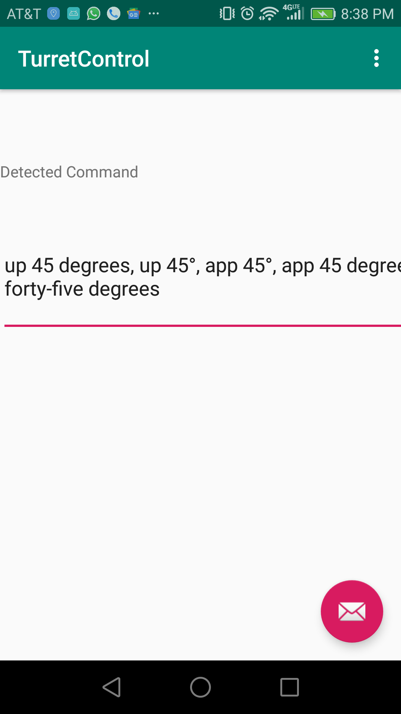
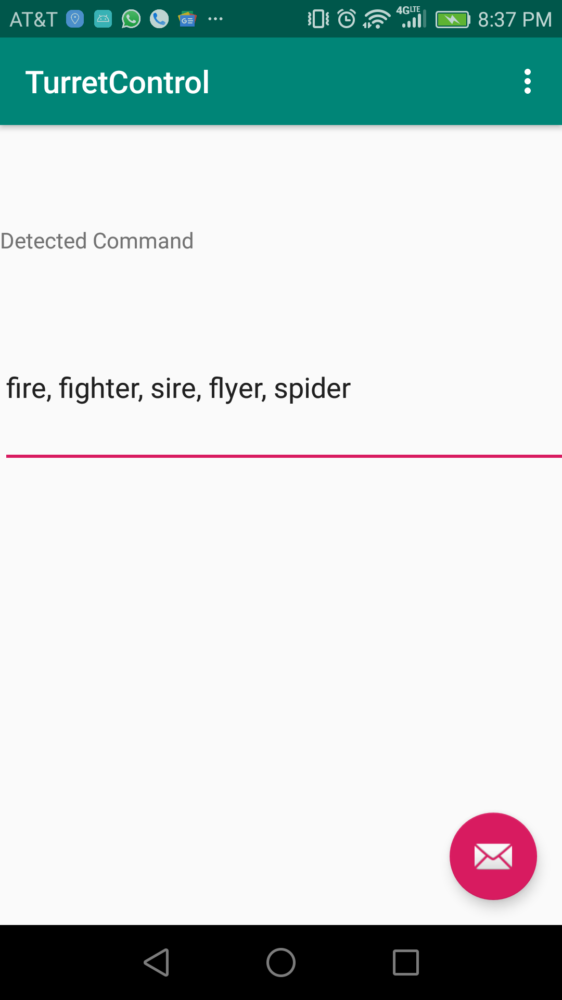

# Android Voice Turret Voice Controller

## Description

Control a toy turret using your voice. Commands are interpreted 
through captured speech and are sent over bluetooth.

### Commands
Command format is still being developed but below you can find a preview
for the expected format:

- __prime__: Prepare payload for firing.
- __fire__: Fire payload. Payload must be primed for this command to
succeed.
- __up X degrees__: Adjust turret pitch upward
- __down X degrees__: Adjust turret pitch downward
- __left X degrees__: Adjust turret yaw left
- __right X degrees__: Adjust turret yaw right

TODO: fix terminology for turret calibration.

### Prototype Pictures

#### Voice Capture

